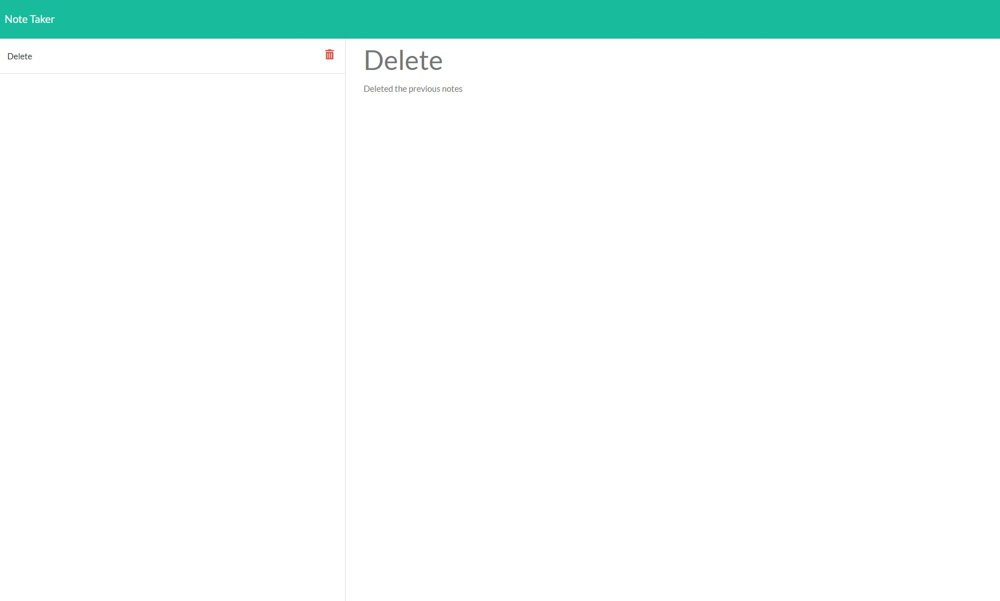
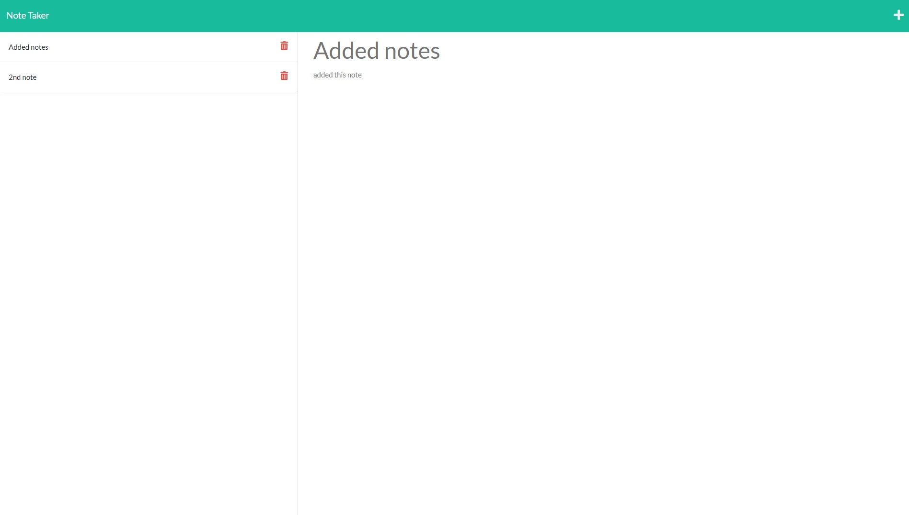

# Note Taker Starter Code

# Note taker

## Description
In this site, you will be able to add as many note as you would like and delete them as needed.

The application can be reached at:

https://rakky21.github.io/noteTaker/
https://github.com/rakky21/noteTaker

It uses Spectre CSS for sytling.

## Usage
### 
1. When you click on "Get Started" it prompts you to the note taking section.
2. Enter a title and a note on the text.
3. Once you're done with the note you can save it.
4. When you click on the title of the note on the left you will see the comment.
5. When you click on the Trash Icon, it will delete that note.

## Snapshots
 
 

## Instructions 

GIVEN a note-taking application
WHEN I open the Note Taker
THEN I am presented with a landing page with a link to a notes page
WHEN I click on the link to the notes page
THEN I am presented with a page with existing notes listed in the left-hand column, plus empty fields to enter a new note title and the note’s text in the right-hand column
WHEN I enter a new note title and the note’s text
THEN a Save icon appears in the navigation at the top of the page
WHEN I click on the Save icon
THEN the new note I have entered is saved and appears in the left-hand column with the other existing notes
WHEN I click on an existing note in the list in the left-hand column
THEN that note appears in the right-hand column
WHEN I click on the Write icon in the navigation at the top of the page
THEN I am presented with empty fields to enter a new note title and the note’s text in the right-hand column